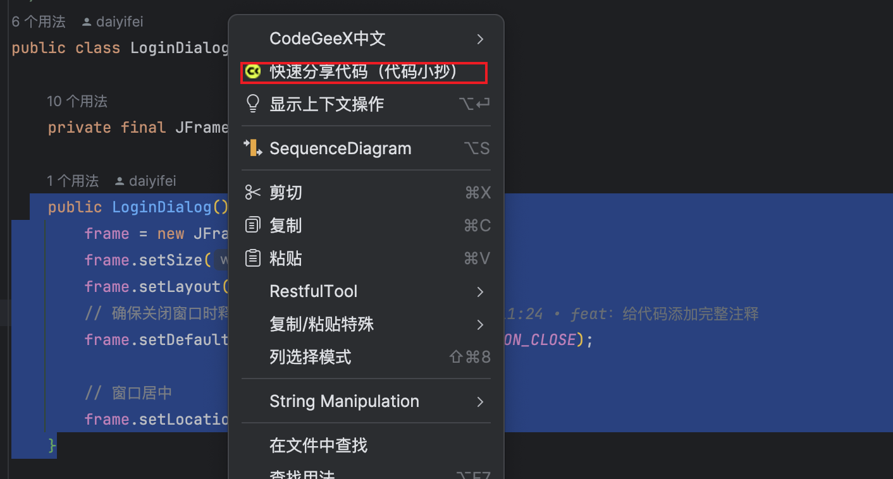
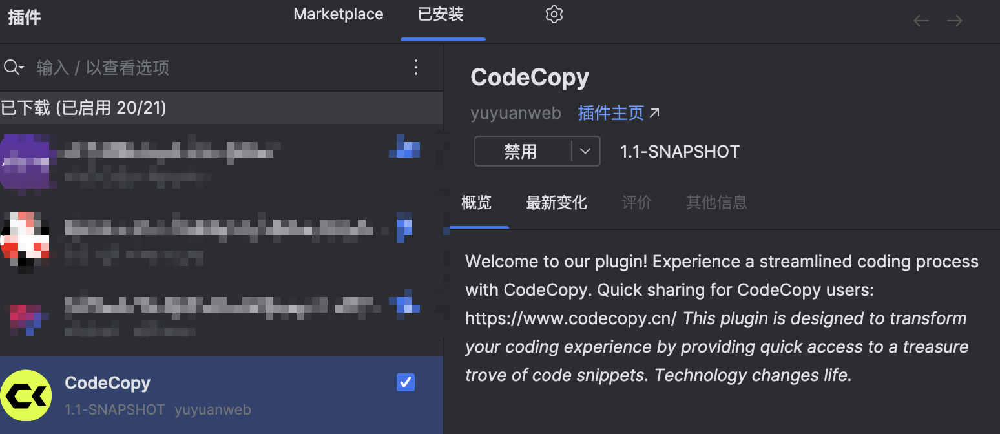

# 代码小抄插件

## 插件简介

这款插件是专为代码小抄项目设计的，旨在为开发人员提供一个高效便捷的方式，直接从IntelliJ IDEA环境中分享代码到个人账户下，并快速获取分享链接。该插件的设计考虑到了开发人员在进行多人协作开发时面临的挑战，尤其是在需要共享代码片段、进行代码审查或即时将本地代码备份到云端存储的场景中，提供了一个极为便利的解决方案。此外，插件支持与代码小抄系统上所有可选的编程语言。

## 如何使用

1）选中我们需要分享的代码，右键选中代码小抄插件：

2）如果是第一次使用，需要先登录代码小抄系统，在弹出界面中扫码登录即可：

3）登录成功后，再次分享即可上传代码到自己的账号下并获取到分享链接（自动复制带剪切板中）：

## 如何安装

在 IDEA 插件市场中搜索：CodeCopy 即可安装：

